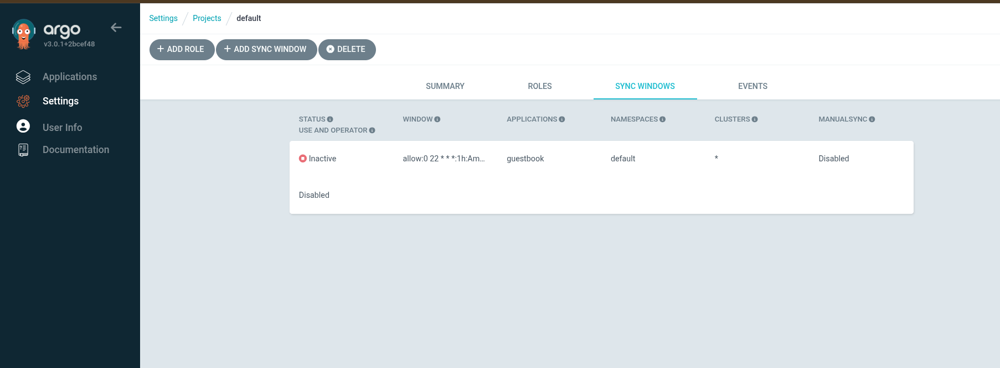

# Sync automático e sync Windows no ArgoCD 

Nas configurações do projeto no ArgoCD, você pode configurar o sync automático e o sync Windows. O sync automático permite que o ArgoCD sincronize automaticamente as alterações feitas no repositório Git com o cluster Kubernetes. O sync Windows, por outro lado, permite que você defina janelas de tempo específicas durante as quais o ArgoCD pode realizar a sincronização.


## Sync automático

O sync automático é uma funcionalidade do ArgoCD que permite que as aplicações sejam sincronizadas automaticamente com o estado desejado definido no repositório Git. Isso significa que, sempre que houver uma alteração no repositório, o ArgoCD irá automaticamente aplicar essas alterações no cluster Kubernetes.

Para habilitar o sync automático, você pode usar a interface do usuário do ArgoCD ou a linha de comando. Aqui está um exemplo de como habilitar o sync automático usando a linha de comando:

```bash
argocd app set <app-name> --sync-policy automated
```
Substitua `<app-name>` pelo nome da sua aplicação. Isso irá habilitar o sync automático para a aplicação especificada.

Você também pode configurar o sync automático para ser acionado apenas quando houver alterações no repositório Git. Para fazer isso, você pode usar a opção `--auto-prune`:

```bash
argocd app set <app-name> --sync-policy automated --auto-prune
```
Isso irá habilitar o sync automático e garantir que o ArgoCD remova automaticamente os recursos que não estão mais presentes no repositório Git.

## Sync Windows

O sync Windows é uma funcionalidade do ArgoCD que permite definir janelas de tempo específicas durante as quais o ArgoCD pode realizar a sincronização. Isso é útil quando você deseja controlar quando as alterações são aplicadas no cluster Kubernetes, por exemplo, para evitar implantações durante horários críticos.

Para configurar o sync Windows, você pode usar a interface do usuário do ArgoCD ou a linha de comando. Aqui está um exemplo de como configurar o sync Windows usando a linha de comando:

```bash
argocd app get guestbook
```

```
argocd proj windows add default \
    --kind allow \
    --schedule "0 22 * * *" \
    --duration 1h \
    --applications "guestbook"
```

Uma alternativa é usar o arquivo de configuração do projeto para definir as janelas de sincronização. Aqui está um exemplo de como fazer isso:

```yaml
apiVersion: argoproj.io/v1alpha1
kind: AppProject
metadata:
  name: default
spec:
  syncWindows:
  - kind: allow
    schedule: '10 1 * * *'
    duration: 1h
    applications:
    - 'guestbook'
    manualSync: true
  - kind: deny
    schedule: '0 22 * * *'
    timeZone: "Europe/Amsterdam"
    duration: 1h
    namespaces:
    - default
  - kind: allow
    schedule: '0 23 * * *'
    duration: 1h
    clusters:
    - in-cluster
```

Neste exemplo, o sync Windows é configurado para permitir a sincronização da aplicação `guestbook` todos os dias às 1h e negar a sincronização durante o horário crítico das 22h às 23h. Você pode ajustar os horários e as aplicações conforme necessário.



## Conclusão

O sync automático e o sync Windows são funcionalidades poderosas do ArgoCD que permitem gerenciar a sincronização das aplicações de forma eficiente e controlada. Com essas funcionalidades, você pode garantir que suas aplicações estejam sempre atualizadas e que as alterações sejam aplicadas no momento certo.
Você pode usar a interface do usuário do ArgoCD ou a linha de comando para configurar essas funcionalidades de acordo com suas necessidades.

## Referências
- [Documentação do ArgoCD - Sync automático](https://argo-cd.readthedocs.io/en/stable/user-guide/sync-options/)
- [Documentação do ArgoCD - Sync Windows](https://argo-cd.readthedocs.io/en/stable/user-guide/sync-windows/)
- [Documentação do ArgoCD - Sync Policy](https://argo-cd.readthedocs.io/en/stable/user-guide/sync-options/#sync-policy)
- [Documentação do ArgoCD - App Project](https://argo-cd.readthedocs.io/en/stable/user-guide/projects/)
- [Documentação do ArgoCD - CLI](https://argo-cd.readthedocs.io/en/stable/cli_reference/)
